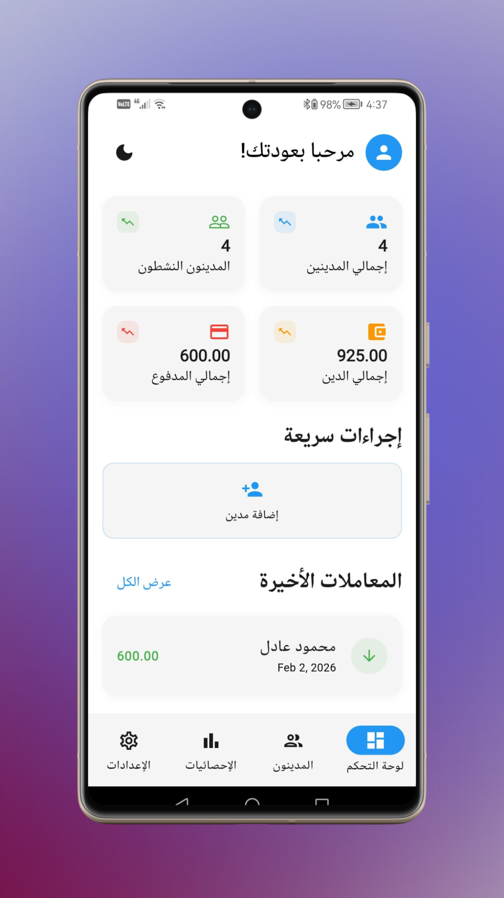
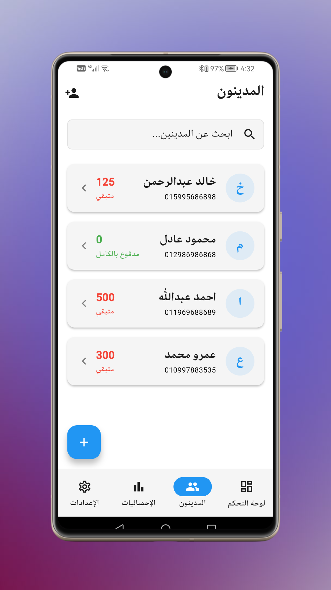
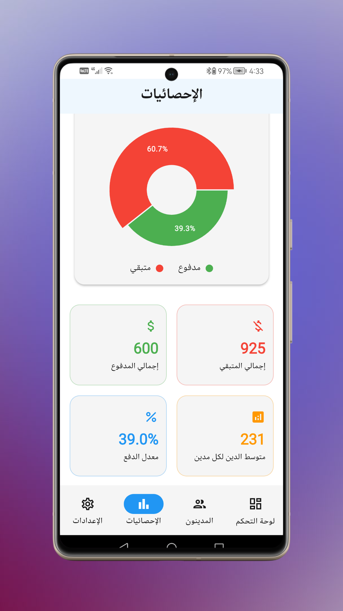

<div align="center">

# 📒 Daftary (Smart Ledger)
### Professional Offline-First Debt Management Solution

<!-- Badges -->
[](https://flutter.dev/)
[](https://dart.dev/)
[-purple?style=for-the-badge)](https://isar.dev/)
[]()

<br />

<!-- DOWNLOAD BUTTON -->
<a href="https://drive.google.com/drive/folders/1CVT2YwvckoGfFG74QPN2GnPa1ANvFsuG?usp=drive_link" target="_blank">
  
</a>

<br />
<br />

**Daftary** is a comprehensive digital ledger application designed to help individuals and small businesses efficiently manage debts, track payments, and organize financial relationships. It serves as a modern, intelligent replacement for traditional paper notebooks.

</div>

---

## 📸 App Screenshots

| Financial Dashboard | Debtors List | Analytics & Overview |
|:---:|:---:|:---:|
|  |  |  |

---

## 🚀 Key Features

### 📊 Smart Financial Dashboard
*   **Instant Overview:** Real-time calculation of total outstanding debts vs. collected payments.
*   **Visual Analytics:** Interactive charts (using `fl_chart`) to visualize financial health and payment trends.
*   **Smart Risk Assessment:** Automated logic to categorize debtors into **Safe**, **Medium**, or **High Risk** based on debt volume.

### 📝 Comprehensive Ledger System
*   **Detailed Profiles:** Manage debtor contact info (Name, Phone, Email) with direct calling integration.
*   **Transaction Tracking:**
    *   **Debts:** Record items or money borrowed.
    *   **Payments:** Log repayments via Cash, Bank Transfer, etc.
*   **History Logs:** Full accessible history for every transaction with date and time filtering.

### 🔒 Performance & Security
*   **Offline-First Architecture:** Built on **Isar Database** (High-performance NoSQL), ensuring instant data access without internet.
*   **Privacy Focused:** All financial data is encrypted and stored locally on the user's device.
*   **Localization:** Full support for **Arabic (ar)** & **English (en)** with auto-detection.
*   **Theme Support:** Beautiful **Light** & **Dark** modes based on Material 3 design.

---

## 🛠️ Technical Architecture

The project follows a modular architecture separating UI, Business Logic, and Data Services.

| Component | Technology |
|:--- |:--- |
| **Framework** | Flutter (Dart 3.x) |
| **State Management** | `provider` (ChangeNotifier) |
| **Local Database** | `isar` (NoSQL) for high-speed query |
| **UI Components** | `fl_chart`, `percent_indicator`, `google_fonts` |
| **Localization** | `flutter_localizations` (.arb files) |

### 📂 Project Structure

```text
lib/
├── models/            # Isar Data Models (Debtor, Transaction)
├── providers/         # State Management & Business Logic
├── services/          # Database Service (Isar Implementation)
├── screens/           # UI Screens (Dashboard, Lists, Details)
├── custom_widgets/    # Reusable Widgets (Cards, Tiles)
└── l10n/              # Localization Files
```
⚙️ Setup & Installation
1.Clone the Repository:
  git clone https://github.com/amrloulah-dev/daftary-debt-manager-flutter.git
2.Install Dependencies:
  flutter pub get
3.Run Code Generator:
  (Required to generate Isar database adapters)
dart run build_runner build --delete-conflicting-outputs
4.Run the App:
  flutter run

<div align="center">
Developed with ❤️ by <a href="https://github.com/amrloulah-dev">Amr Loulah</a>
</div>

